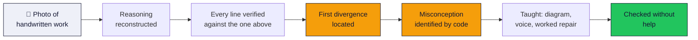
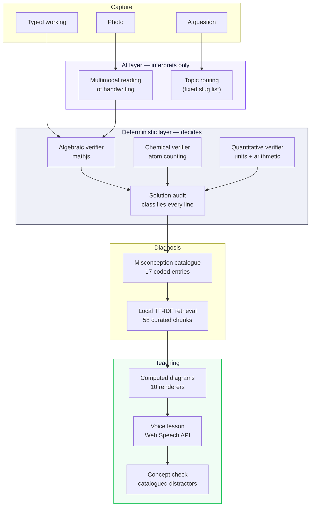
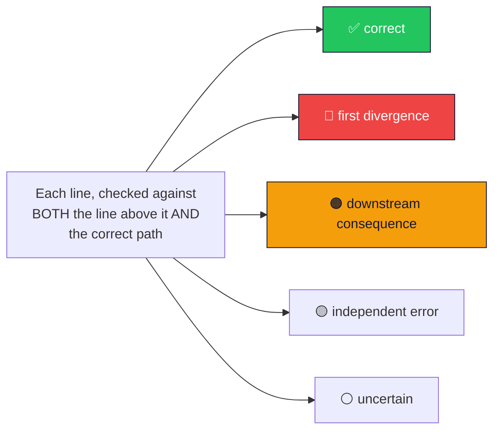
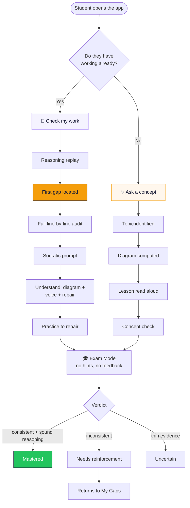
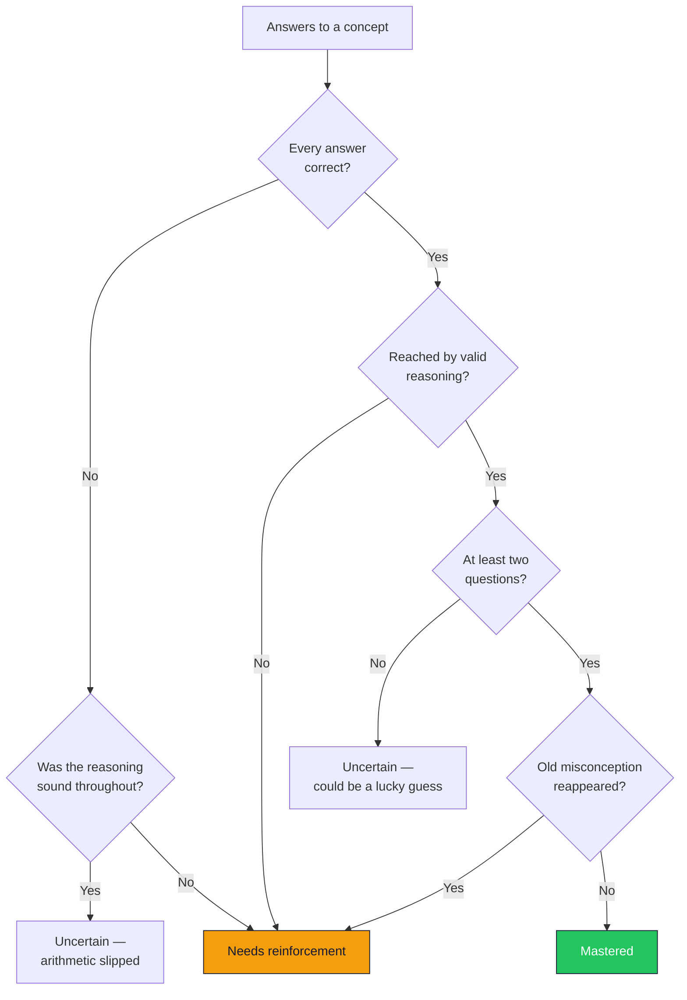
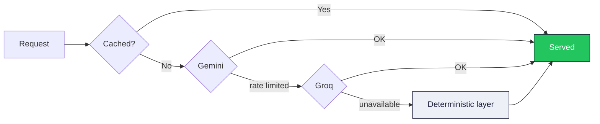

# GapFinder

**Don't just find the wrong answer. Find where understanding broke.**

[**Live app →**](https://gap-finder-green.vercel.app/)

A mobile-first learning tool that reads a student's handwritten working, rebuilds their reasoning line by line, and locates the exact step where their understanding diverged — then teaches that one thing, with a diagram, a voice, and a check that it landed.

---

## The problem

Every homework tool on the market grades the destination. A student photographs their work and is told the answer is wrong, or shown a correct solution to compare against.

That tells them something they already knew.

The interesting question is not *whether* they were wrong. It is **which line stopped following from the one above it**, and **what rule they were applying when they wrote it** — because that rule will produce the same error next week, on a different question, in a different chapter.

A student who writes six lines and makes one conceptual error at line two will have five wrong lines. Four of them are not mistakes. They are the faithful consequences of a single broken idea. Grading them all as errors teaches the student that they are bad at algebra. Finding the one that matters teaches them algebra.

---

## What GapFinder does



### The core claim, demonstrated

Given this worksheet — a real one, with the student's own note circling step 3:

```
2(3x-5) - 4(x+2) = 3(x-1) + 7
6x - 10 - 4x + 8 = 3x - 1 + 7      ← distribution error is HERE
2x - 2 = 3x + 6
2x - 3x = 6 + 2
-x = 8
x = -8                              ← student thinks the error is here
```

GapFinder reports the divergence at **step 2**, not step 3. `-4(x+2)` became `-4x + 8`; the negative reached the first term and not the second. Every line after it is labelled a **downstream consequence** — arithmetically faithful to a broken premise. The correct answer is `x = -22`.

The student circled the wrong line. So would most tools.

---

## Architecture

The rule the whole system is built on:

> ### AI interprets. Deterministic code verifies.

A model never decides whether a student is wrong. It reads handwriting and routes a question to a topic. Everything a student is *told* is either computed by code that can be checked, or drawn from a curated corpus.



### Why this matters

A tutoring product's only real asset is trust. The moment a student catches it confidently asserting something false, every correct thing it said afterwards is worth less. So:

- **Verdicts are proved, not predicted.** `2x + 7 = 15 → 2x = 8` is verified by algebra, not by asking a model whether it looks right.
- **Misconceptions carry stable codes.** `M-DISTRIBUTE-NEGATIVE` is countable across students and across sessions. A model-authored label is not.
- **Diagrams are computed from the student's own verified numbers.** No image generation touches a maths diagram.
- **Citations are never generated.** Research and video results come from Crossref, arXiv and the YouTube Data API with real metadata, and each result carries how it was obtained.
- **Provenance is visible.** Content from the verified library is badged as such. Content generated for a topic outside it is badged differently, on the same screen, before the student reads it.

---

## The complete solution audit

Most tools return a boolean. GapFinder classifies **every line** into one of five states:



| State | Meaning |
|---|---|
| **correct** | Follows from the line above, and matches the correct path |
| **first divergence** | The first line that does not follow. **This is the gap.** |
| **downstream consequence** | Wrong, but faithful to the student's own previous line — not a new mistake |
| **independent error** | A *second*, separate mistake, not caused by the first |
| **uncertain** | Cannot be verified. Says so, rather than guessing |

`uncertain` is a first-class outcome. An equation with three free variables cannot be checked against one line, and claiming otherwise would mean accusing a student who was right.

---

## The two entry points



A student who hasn't written anything yet has no reasoning to diagnose. Telling them to go and make a mistake first would be a strange thing for a learning tool to do — so **Ask a Concept** answers directly, and ends in the same check.

---

## Exam Mode: mastery is a claim, and claims need evidence



Three rules, enforced in code and covered by tests:

1. **One right answer is never mastery.** It is equally consistent with understanding, a lucky guess, and remembering a similar problem.
2. **A right answer through broken reasoning is never mastery.** Correct destination, invalid route.
3. **A returning misconception is decisive**, whatever the score. The old habit coming back matters more than the total.

---

## Subject coverage

Each subject states plainly what is **proved** versus what is **reviewed**, and the app never blurs the two.

| Subject | Proved deterministically | Reviewed against curated knowledge |
|---|---|---|
| **Math** | Each step follows from the last; distribution, rearrangement, solving; the final answer | Why the concept broke; what to practise |
| **Physics** | Substitution into a formula; arithmetic at every step; dimensional consistency | Choice of formula; free-body reasoning |
| **Chemistry** | Balance element by element; no element appears or vanishes; mole arithmetic | Mechanisms; which products form |
| **Biology** | Punnett ratios; process inputs and outputs | Explanations and reasoning |

**22 concepts. 58 curated knowledge chunks. 17 catalogued misconceptions. Every concept renders a computed diagram.**

---

## Engineering

| | |
|---|---|
| **Framework** | Next.js 14 App Router, TypeScript (strict, `noUncheckedIndexedAccess`) |
| **Styling** | Tailwind with a CSS-variable palette; mobile-first at 390×844 |
| **Database** | PostgreSQL (Neon) via Prisma |
| **AI** | Google Gemini (multimodal, structured output) → Groq → deterministic |
| **Verification** | mathjs; custom chemical and dimensional verifiers |
| **Retrieval** | Local TF-IDF over a curated corpus — no paid vector database |
| **Voice** | Web Speech API, in and out |
| **Auth** | JWT sessions via `jose`, verified in middleware |
| **Tests** | **201 passing** — unit, integration, and a deterministic eval harness |

### Resilience by design



A free-tier rate limit is a certainty, not an edge case. When every provider is exhausted, the divergence is still located, the misconception is still identified, the diagram is still drawn, and the confidence shown to the student drops to match. The core diagnosis never depends on a model being reachable.

---

## Running it

```bash
npm install
cp .env.example .env          # add DATABASE_URL, SESSION_SECRET, GEMINI_API_KEY
npm run db:push && npm run db:seed
npm run dev
```

Where port 5432 is blocked by a network, schema changes apply over HTTPS instead:

```bash
npm run db:apply prisma/manual/001-exam-tables.sql
```

### Verification

```bash
npm test          # 201 tests
npm run lint
npx tsc --noEmit
npm run build
```

---

## Repository map

```
src/
├── app/
│   ├── (main)/          Screens: home, scan, analysis, learn, exam, gaps, roadmap
│   └── api/             analyses, explain, exam, gaps, coach, knowledge, resources
├── lib/
│   ├── verification/    Deterministic verifiers — the layer that decides
│   ├── diagnosis/       Misconception catalogue and signature detection
│   ├── math/            Algebraic solving and step derivation
│   ├── ai/              Provider cascade, schemas, RAG, visual selection
│   ├── concepts/        Question intent, topic routing, curated examples
│   ├── teaching/        Lesson construction from proved values
│   ├── quiz/            Concept checks built from the catalogue
│   └── exam/            Exam construction and verdict rules
├── components/
│   ├── visuals/         10 deterministic diagram renderers
│   └── analysis/        Diagnosis presentation
prisma/
├── schema.prisma
├── seed.ts              Concepts, knowledge chunks, achievements
└── manual/              HTTPS-applied migrations
tests/                   201 tests
docs/ARCHITECTURE.md     Deeper technical detail
```

---

## Design principles

1. **Never claim more than was verified.** "Uncertain" is a valid, frequently correct answer.
2. **A wrong answer is data.** Every distractor in a concept check is a documented misconception, so choosing one names the rule the student holds.
3. **The root error and its consequences are different things.** Conflating them is the single most common failure of automated marking.
4. **Show provenance.** Verified, generated, and retrieved content are visibly distinct.
5. **Degrade honestly.** Reduced confidence, stated plainly, beats a confident guess.

---

<div align="center">

**GapFinder** · Built for students who already know the answer is wrong.

</div>
