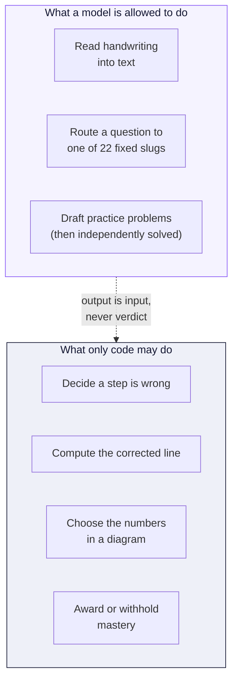
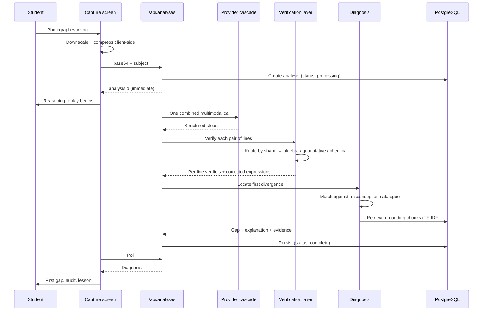
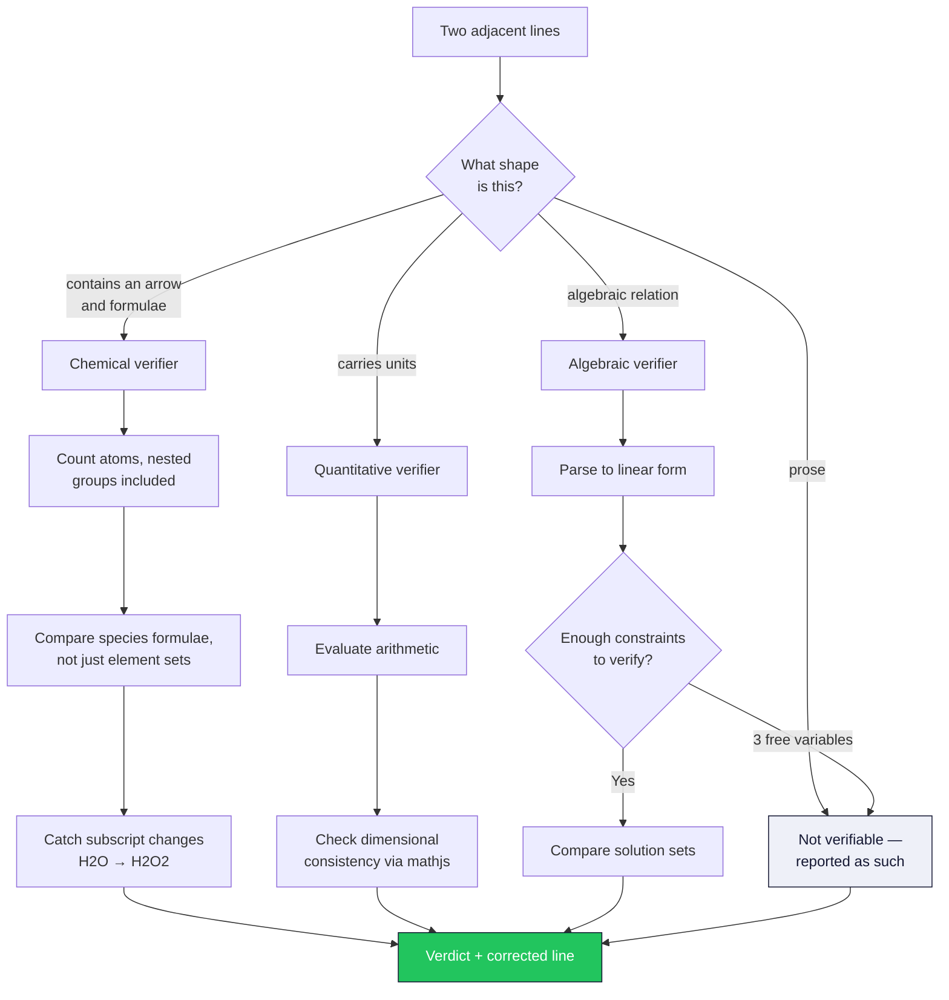
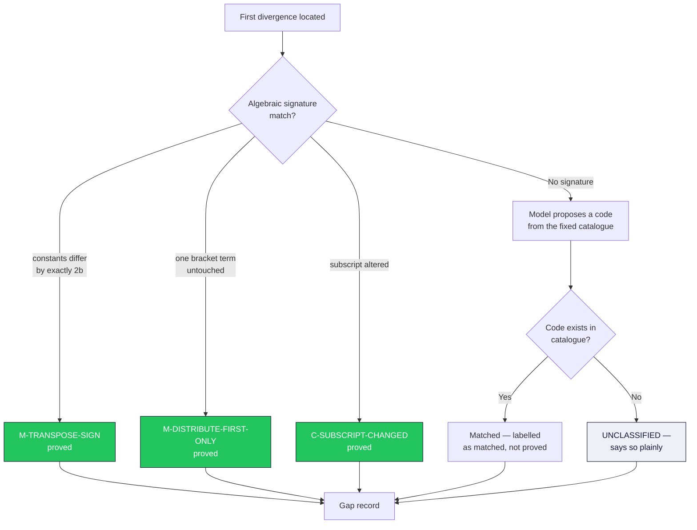
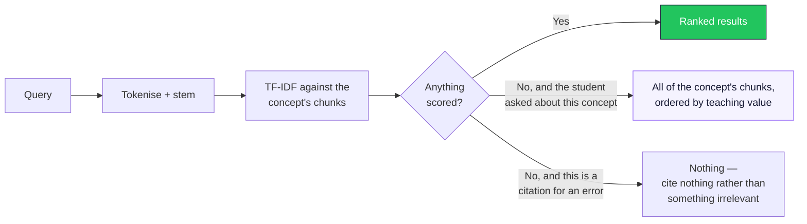
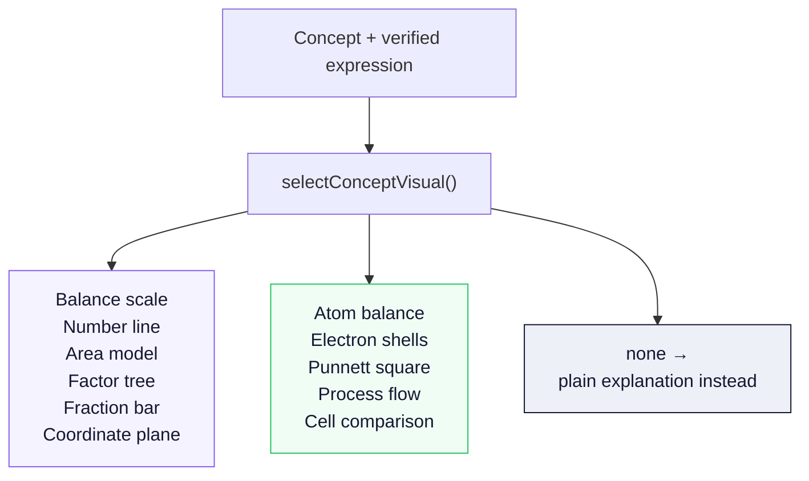
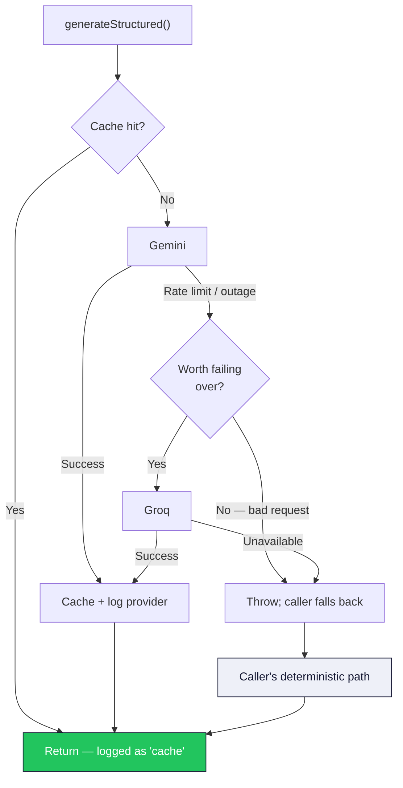
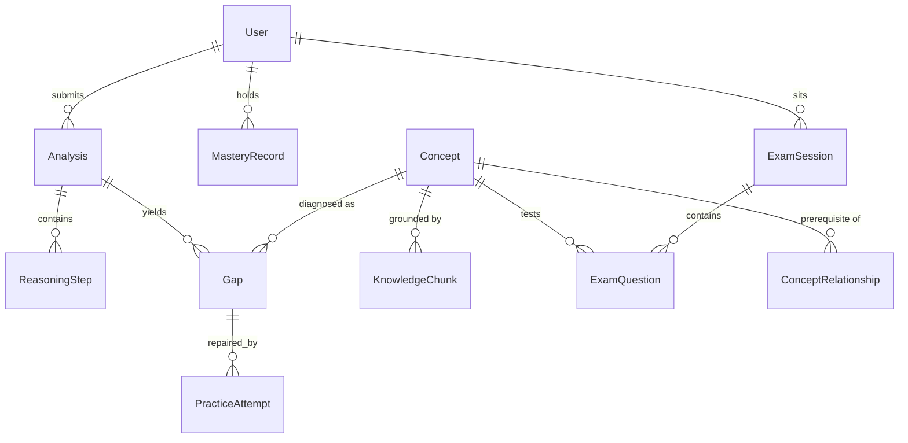

# GapFinder — Architecture

How the system is put together, and why each boundary sits where it does.

---

## 1. The governing constraint

Every design decision in this codebase descends from one rule:

> **AI interprets. Deterministic code verifies.**

A language model is excellent at reading handwriting, at inferring what a student meant by an ambiguous scrawl, and at mapping "how do plants make food" onto a topic. It is not a source of truth about whether `2x = 15 + 7` follows from `2x + 7 = 15`.

So the two capabilities are separated at the architectural level, not merely by prompt engineering.



The practical test applied to every feature: *if the model returned nonsense here, would a student be told something false?* If yes, the feature is built differently.

---

## 2. Request lifecycle — analysing student work



The `analysisId` returns before the pipeline finishes. The replay animation is not a loading spinner dressed up — it is real elapsed work, shown as reasoning being reconstructed.

---

## 3. Verification layer

The layer that actually decides. Every pair of adjacent lines is routed by **shape**, not by the subject the student selected — a chemistry paper is full of algebra, and the algebra in it is still checkable algebra.



### The free-variable guard

`v = u + a*t` has three unknowns. No single line can be verified against it, and an early version of the verifier accused students who were entirely correct. The guard counts free variables and returns **"could not verify"** rather than a verdict.

An honest "I can't check this" costs a student nothing. A false accusation costs the product their trust permanently.

---

## 4. Diagnosis: from a wrong line to a named misconception



Some misconceptions have an **algebraic signature** — a fingerprint in the numbers themselves. Transposing without inverting means the constants differ by exactly twice the transposed term. That is provable, and when it is proved the app says "proved" rather than "probably".

Where no signature exists, a model may select from the catalogue, and the difference in certainty is carried through to the interface.

---

## 5. Retrieval

A curated corpus of 58 chunks across 22 concepts, searched with local TF-IDF. No embedding API, no vector database, no recurring cost.



The two fallback paths are deliberately different. Scoring is meant to *order* results; when a student asks about a concept by name, everything filed under that concept is relevant by construction and the score should not gate it. When retrieving evidence to justify a specific diagnosis, an unrelated chunk is worse than none.

---

## 6. Visuals

Ten renderers. Every parameter is computed — from the student's own verified working during a diagnosis, or from a curated worked example when explaining a concept.



### The `allowCuratedExample` boundary

Curated examples — the physics relationship graphs, the parabola, the sodium atom — are correct statements about their concept, and say nothing about *this* student's working. Drawing one beside a diagnosis would put a picture on screen that the student's own lines cannot be checked against.

So they are **off by default** and enabled only on the explainer path, where no student working exists. A test asserts that a diagnosis context never renders one.

---

## 7. Provider cascade



Every attempt is logged with the provider that served it and the latency, visible in the observability view. A malformed request is not retried against a second provider — only failures worth failing over are.

### Schema sanitisation

`zodToJsonSchema` emits `additionalProperties`, which Gemini's structured-output endpoint rejects outright. `to-gemini-schema.ts` reduces every schema to the key subset Gemini accepts, inlining `$ref` and collapsing `anyOf`. Without it, every structured call in the project returns a 400.

---

## 8. Data model



`Gap.misconceptionCode` is the join that makes longitudinal tracking possible: the same code appearing in a homework diagnosis and in an exam answer is recognised as the same event, because both were produced by the same catalogue.

---

## 9. Security

| Concern | Handling |
|---|---|
| Route protection | `src/middleware.ts` verifies the JWT with `jose` on every protected path |
| Session secret | Rejected if absent or under 16 characters — no silent insecure default |
| Cross-user access | Every query is scoped by `userId`; another user's analysis returns 404, not 403 |
| Login timing | Constant-time comparison; identical response for unknown user and wrong password |
| Uploads | Strict MIME allowlist, size ceiling, client-side downscale before transmission |
| Secrets | Environment variables only; never logged, never returned to a client |

> **Note on middleware placement.** A root-level `middleware.ts` is silently ignored when a `src/` directory exists. It lives in `src/middleware.ts`, and cross-user isolation is verified: no cookie → 307, forged token → 307, valid token → 200, another user's record → 404.

---

## 10. Testing

```
201 tests
├── Verification      Algebraic, chemical, dimensional correctness
├── Diagnosis         Signature detection, catalogue matching
├── Audit             Five-state classification, downstream propagation
├── Exam verdicts     Mastery rules, including refusal to over-claim
├── Concept explainer Intent detection, routing, lessons, quiz construction
├── Fabrication       Citations, URLs, statistics stripped from generated text
└── Eval harness      15 fixtures, deterministic, end-to-end
```

The eval harness is the one that matters most: fixed worked solutions with known error locations, asserting that the pipeline finds the right line. It runs without a model, so a regression in the deterministic core cannot hide behind a good day from an API.

---

## 11. Performance

| Decision | Effect |
|---|---|
| Four Gemini calls collapsed into one combined multimodal call | ~4× fewer round trips per analysis |
| Client-side image downscaling before upload | Large phone photos transmit in a fraction of the bytes |
| `waitUntil` for post-response work | Response returns before background persistence completes |
| Content-hashed AI cache | Repeat questions cost nothing |
| Resource providers run concurrently | Slowest provider sets the wait, not the sum |
| Resources load after the diagnosis renders | A student never waits on an external API to see what they got wrong |

---

## 12. Extension points

**A new subject** needs a verifier in `lib/verification/domains/`, a routing rule in `verify-step.ts`, an entry in `lib/subjects.ts` declaring what it proves versus reviews, catalogue entries in `lib/diagnosis/misconceptions.ts`, and knowledge chunks in the seed.

**A new visual** needs a module variant in `select-visual.ts`, a renderer in `components/visuals/`, and a case in `ConceptVisual.tsx`. The renderer receives computed parameters and draws them — it never calculates.

**A new provider** implements the `AiProvider` interface and joins the `PROVIDERS` array. The cascade, caching, logging and fallback behaviour come for free.
