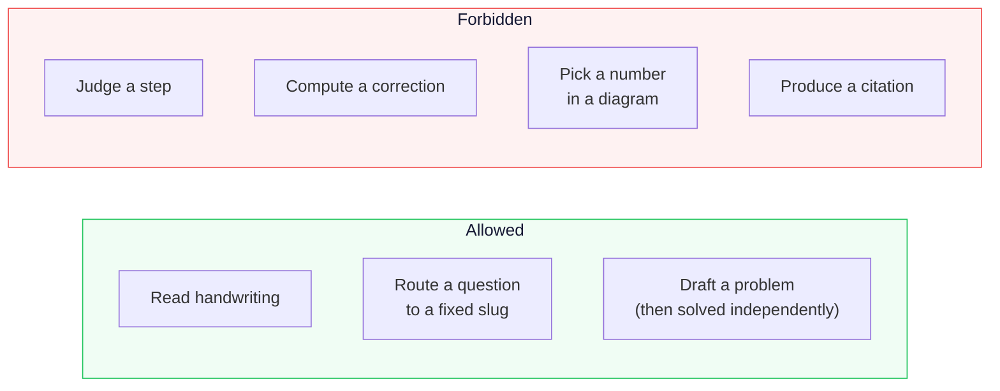

# GapFinder — Against the judging criteria

A direct mapping from each criterion to the evidence in this repository, with file references so every claim can be checked.

---

## Educational Impact

### The pedagogical thesis

Automated marking grades destinations. Learning happens at the point of divergence.

When a student makes one conceptual error at line two of a six-line solution, five lines are wrong — but only one is a mistake. The other four are *arithmetically faithful* to a broken premise. Marking all five as errors teaches a student that they are bad at the subject. Isolating the one that matters teaches them the subject.

GapFinder is built entirely around that distinction.

### How it shows up in the product

| Design decision | Educational reason |
|---|---|
| Five-state audit, distinguishing root error from downstream consequence | A student sees they made **one** mistake, not five |
| Misconceptions stated as *the rule the student is applying* | Reframes the error as a coherent belief, not carelessness |
| Socratic prompt before the explanation | The student notices it themselves first |
| One right answer never counts as mastery | Prevents false confidence, which is worse than none |
| Transfer problems change surface form, not reasoning | Success cannot be explained by pattern-matching a layout |
| Exam Mode withholds all feedback until the end | Seeing "correct" after Q1 changes how Q2 is approached |
| "Uncertain" is a first-class verdict | Never accuses a student who was right |

### Verifiable claims

- **17 documented misconceptions** across four subjects, each with the student's rule, why it fails, and a Socratic prompt — `src/lib/diagnosis/misconceptions.ts`
- **Stable codes** (`M-DISTRIBUTE-NEGATIVE`) that are countable across students and sessions, so a relapse in an exam is recognisably the same event as a relapse in homework
- **Mastery rules enforced by tests**, not by pitch copy — `tests/exam-verdict.test.ts`

---

## AI / Machine Learning

### The architectural position

The interesting AI decision in this project is **what the model is not allowed to do**.



A tutoring product that hallucinates once is worth less on everything it says afterwards. Constraining the model is not a limitation of the approach — it *is* the approach.

### Techniques applied

| Technique | Where | Why |
|---|---|---|
| Multimodal structured output | `pipeline/analyze-work.ts` | One combined call replaces four; schema-enforced shape |
| Schema sanitisation | `ai/schemas/to-gemini-schema.ts` | Gemini rejects `additionalProperties`; this reduces any Zod schema to its accepted subset |
| Provider cascade | `ai/ai-client.ts` | Gemini → Groq → deterministic, with per-attempt provider logging |
| Content-hashed caching | `ai/cache-key.ts` | Identical prompts never bill twice |
| Local TF-IDF RAG | `ai/rag/retrieve.ts` | Grounding without an embedding API or vector database |
| Constrained classification | `concepts/route-question.ts` | The model chooses from a fixed slug list, never free text |
| Output sanitisation | `pipeline/explain-concept.ts` | Citations, DOIs, URLs and statistics stripped before display |
| Independent validation | `fallback/practice-templates.ts` | A generated problem is solved by code before a student sees it |

### Grounding is traceable end to end

Every explanation records the chunk IDs it drew on. `/api/knowledge` returns those chunks, and the interface shows the student exactly what the answer was grounded in. Retrieval is auditable per call in the observability view.

---

## Technical Execution

### Verification

```
201 tests passing
TypeScript strict, including noUncheckedIndexedAccess
ESLint clean
Production build clean
Deployed and live
```

### Substance behind the numbers

**Deterministic evaluation harness** — 15 fixed worked solutions with known error positions. It runs with no model involved, so a regression in the core cannot be masked by a good day from an API.

**Real verifiers, not string comparison:**
- Algebraic equivalence via mathjs, with a free-variable guard that refuses to judge under-determined lines
- Atom counting through nested groups: `Al2(SO4)3` → `{Al: 2, S: 3, O: 12}`
- Species-level chemical comparison that catches the subscript cheat (`H2O` → `H2O2`)
- Dimensional analysis via mathjs units

**Security, verified rather than assumed:**
- Middleware placed correctly under `src/` — a root-level file is silently ignored when `src/` exists
- Cross-user isolation returns 404: no cookie → 307, forged token → 307, valid → 200, other user's record → 404
- Constant-time login comparison; identical responses for unknown user and wrong password

**Operational engineering:**
- HTTPS migration path via `@neondatabase/serverless` for networks where port 5432 is closed
- `waitUntil` for post-response persistence on serverless
- Client-side image compression before upload
- Structural up-navigation, so back behaves identically after a refresh as it does mid-session

### Product surface

22 concepts · 58 knowledge chunks · 17 misconceptions · 10 diagram renderers · 4 subjects · voice in and out · every concept renders a computed diagram.

---

## Pitch & Demo

### The hook

> A student photographs her homework. She has already circled step three — she knows something went wrong there.
>
> GapFinder finds it at step two.

That single frame carries the entire product thesis, and it is reproducible live: `2(3x-5) - 4(x+2) = 3(x-1) + 7`, divergence at the distribution, everything after it labelled downstream, correct answer `x = -22`.

### What a judge can verify in ninety seconds

1. Photograph working → the divergence lands one line earlier than expected
2. Open the audit → every line classified, not just marked
3. Tap the lesson → a computed diagram, then the explanation read aloud
4. Ask a concept in any subject → diagram, voice, then a check
5. Take the check → two right out of three returns *"Not consistent enough to call it settled"*

Point five is the one that separates this from a demo. Almost every tutoring product will tell a student they did well.

### Differentiation

| Common approach | GapFinder |
|---|---|
| Marks the final answer | Classifies every line into five states |
| "This step is wrong" | "This is the first step that stopped following, and here is the rule you were applying" |
| Model-authored feedback labels | Stable codes, countable across students and sessions |
| Generated diagrams | Diagrams computed from the student's own verified numbers |
| Model-supplied references | Crossref, arXiv and YouTube metadata, each labelled with how it was obtained |
| Correct answer ⇒ mastery | Mastery requires consistency, sound reasoning, and no relapse |

---

## Where to look

| Claim | File |
|---|---|
| Five-state audit | `src/lib/verification/solution-audit.ts` |
| Free-variable guard | `src/lib/verification/verify-step.ts` |
| Nested-group atom counting | `src/lib/verification/domains/chemistry.ts` |
| Misconception catalogue | `src/lib/diagnosis/misconceptions.ts` |
| Algebraic signature proof | `src/lib/diagnosis/detect-misconception.ts` |
| Mastery rules | `src/lib/exam/verdict.ts` |
| Provider cascade | `src/lib/ai/ai-client.ts` |
| Gemini schema sanitiser | `src/lib/ai/schemas/to-gemini-schema.ts` |
| Deterministic visual selection | `src/lib/ai/visuals/select-visual.ts` |
| Fabrication stripping | `src/lib/ai/pipeline/explain-concept.ts` |
| Auth middleware | `src/middleware.ts` |
| Eval harness | `tests/` |
